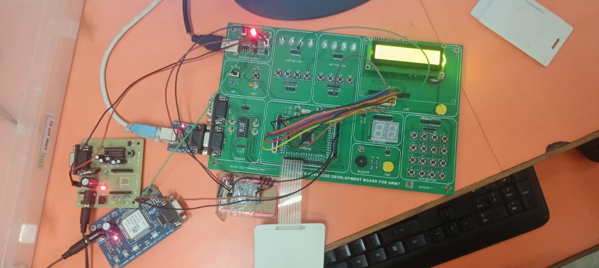
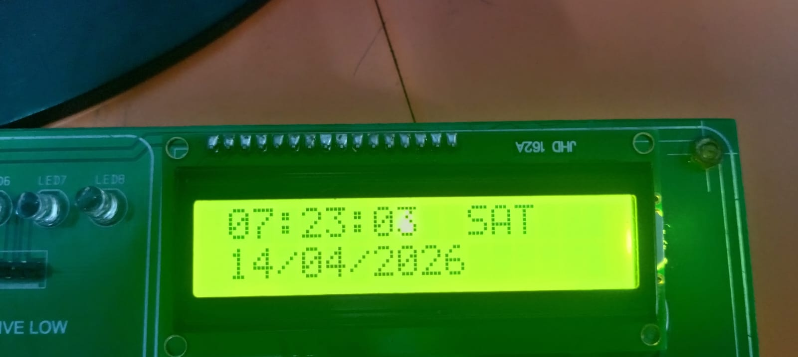
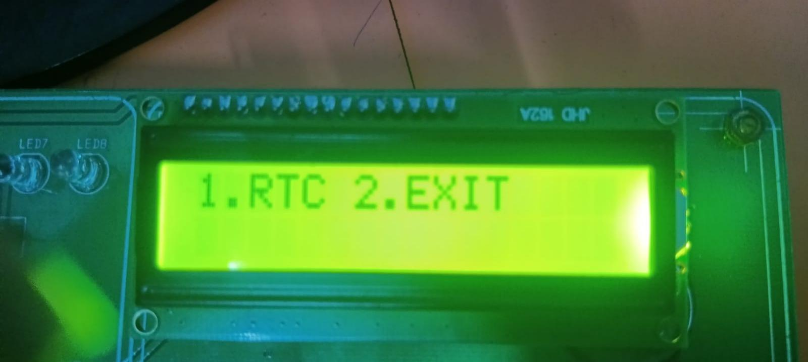

# Major-Project
## SECUREPASS DUO : GSM AND RFID OTP BASED AUTHENTICATION SYSTEM 
## Overview
The RFID and OTP Based Smart Security Access Control System is a two-factor authentication embedded security solution developed using the LPC2148 ARM7 microcontroller. The system enhances traditional RFID-based access control by integrating GSM-enabled One-Time Password (OTP) verification.
In conventional RFID systems, unauthorized access may occur if an RFID card is lost, stolen, or duplicated. To overcome this limitation, the proposed system introduces OTP-based verification as a second layer of security. After successful RFID authentication, a dynamically generated OTP is sent to the authorized user's mobile number via GSM modem. Access is granted only when the correct OTP is entered within the specified validity period.
This project demonstrates the integration of RFID technology, GSM communication, RTC, LCD, Keypad, Interrupts, and Relay Control into a practical real-time embedded security application.

## Features
## Two-Factor Authentication (RFID + OTP)
RFID-Based User Identification
Dynamic OTP Generation
GSM-Based OTP Delivery
RTC-Based OTP Timeout Monitoring
LCD User Interface
Keypad-Based OTP Entry
Interrupt-Driven Communication
Administrator Configuration Mode
Relay-Based Door Lock Control
Secure Access Verification
Real-Time Embedded Operation
## Problem Statement
Traditional RFID access systems depend solely on RFID card authentication. If an RFID card is stolen, duplicated, or shared, unauthorized users can gain access to restricted areas.
The objective of this project is to improve access security by introducing a second authentication layer using GSM-based OTP verification. Even if an RFID card is compromised, access cannot be granted without the OTP received on the authorized mobile device.

## Objectives
## Primary Objective
To develop a secure access control system using RFID and OTP technologies for enhanced authentication and protection.

## Secondary Objectives
- Authenticate users using RFID technology.
- Generate dynamic OTPs using RTC values.
- Send OTPs through GSM modem.
- Verify user-entered OTP using keypad.
- Restrict access after multiple invalid attempts.
- Maintain real-time system operation.
- Provide administrator-controlled RTC configuration.
- Control door lock mechanism through relay operation.
## Hardware Requirements
- LPC2148 ARM7 Development Board
- RFID Reader Module(AT89C2051)
- RFID Tag/Card
- GSM Modem (M660A)
- 16x2 LCD Display
- 4x4 Matrix Keypad
- Power Supply Unit
- Connecting Wires
## Software Requirements
Keil uVision IDE
Embedded C Programming Language
Flash Magic
LPC2148 Device Support Package
## System Architecture
```
   RFID Card
      |
      V
  RFID Reader
     |
     V
 LPC2148 Controller
     |
     +----------------+
     |                |
     V                V
 GSM Modem         RTC Module
     |                |
     V                |
 SMS OTP              |
     |                |
     +-------+--------+
             |
             V
      Matrix Keypad
             |
             V
      OTP Verification
             |
      +------+------+
      |             |
      V             V
 Access Granted   Access Denied
      |
      V
  Door open
```

## Project Images

<p float="left">
  
  
  
   
  
</p>

## Demo Videos

  <p float="left">
  
    
</p>

## Project Workflow

1. System Initialization
2. RFID Card Detection
3. RFID Authentication
4. Dynamic OTP Generation
5. OTP Transmission through GSM
6. User OTP Entry via Keypad
7. OTP Verification
8. Access Decision

## Working Principle
## Step 1: RFID Authentication
The RFID reader scans the RFID card and sends the card ID to LPC2148 through UART1 communication.
The received RFID tag is compared with the authorized RFID database stored within the system.
## Step 2: OTP Generation
After successful RFID verification, the system generates a dynamic four-digit OTP using current RTC time values.
## Step 3: GSM Communication
The generated OTP is transmitted to the registered mobile number using GSM modem AT commands.
## Step 4: OTP Verification
The user enters the received OTP through the matrix keypad. The entered OTP is compared with the generated OTP.
## Step 5: Access Control
If the OTP matches and is within the valid time limit:
- Access is granted.
- Door unlocks for authorized entry.
If OTP verification fails:
- Access is denied.
- User receives limited retry attempts.
- System returns to monitoring mode.
## Source Files Description
## securemain.c
Main application responsible for:
- RFID authentication
- OTP generation
- OTP verification
- Access Granted or Declined
## gsm.c
Handles:
- GSM initialization
- AT command communication
- SMS transmission
## rtc.c
Provides:
- RTC initialization
- Time and date management
- RTC display functionality
- uart_interuppt.c
- UART0 driver responsible for:
- GSM communication
- Interrupt-based serial reception
## uart_interuppt1.c
UART1 driver responsible for:
- RFID communication
- RFID data reception
## lcd.c
LCD interface driver:
- LCD initialization
- Character display
- String display
- Numeric display
## kpm.c
- Matrix keypad interface:
- Key scanning
- Numeric input reading
- OTP entry support
## admin.c
Administrator module:
- RTC parameter modification
- System configuration
## extinteruppt.c
- External interrupt module:
- Admin mode activation
## delay.c
- Software delay routines:
- Microsecond delay
- Millisecond delay
- Second delay
## Technical Concepts Used
- ARM7 LPC2148 Microcontroller
- Embedded C Programming
- UART Communication
- Interrupt Handling
- RFID Interfacing
- GSM Modem Interfacing
- RTC Programming
- LCD Interfacing
- Matrix Keypad Interfacing
- GPIO Programming
- Real-Time Embedded Systems
## Project Outcomes
## Security Outcomes
- Successfully implemented Two-Factor Authentication.
- Improved access security compared to traditional RFID systems.
- Prevented unauthorized access through dynamic OTP verification.
- Restricted invalid authentication attempts.
## Technical Outcomes
- Successfully interfaced RFID Reader with LPC2148.
- Implemented GSM communication using UART0.
- Implemented RFID communication using UART1.
- Developed RTC-based OTP generation mechanism.
- Integrated LCD and Keypad user interface.
- Implemented relay-controlled door access.
- Developed interrupt-driven communication modules.
## Learning Outcomes
The project provided practical experience in:
- Embedded Firmware Development
- ARM7 Programming
- Peripheral Interfacing
- Interrupt Programming
- Serial Communication
- Embedded Security Systems
- Hardware-Software Integration
- Real-Time Application Development
## Performance Outcomes
- Reliable RFID authentication.
- Accurate OTP verification.
- Stable GSM communication.
- Real-time system response.
- User-friendly operation.
## Applications
- Residential Security
- Smart Home Access Control
- Apartment Security Systems
- Educational Institutions
- Laboratory Access Control
- Examination Record Room Protection
- Industrial Applications
- Restricted Production Areas
- Equipment Control Rooms
- Corporate Environments
- Employee Authentication Systems
- Server Room Security
- Research Facilities
- Laboratory Security
- Asset Protection Systems
## Advantages
1. Enhanced Security
2. Low Cost Implementation
3. Real-Time Operation
4. Easy User Interaction
5. Modular Design
6. Reliable Authentication
7. Expandable Architecture
## Future Scope
1. Fingerprint Authentication
2. Face Recognition Integration
3. Mobile Application Monitoring
4. Cloud-Based Access Logging
5. IoT Connectivity
6. Wi-Fi Integration
7. Database-Based User Management
8. Remote Access Control
9. Real-Time Security Notification
## Conclusion
The RFID and OTP Based Smart Security Access Control System successfully demonstrates a secure and reliable embedded authentication platform using LPC2148. By integrating RFID identification with GSM-based OTP verification, the system provides enhanced protection against unauthorized access.
The project effectively combines multiple embedded technologies including RFID, GSM, RTC, LCD, Keypad, Interrupts, and Relay Control into a single real-time application. The developed system serves as a practical, scalable, and cost-effective security solution suitable for residential, industrial, educational, and commercial environments.
